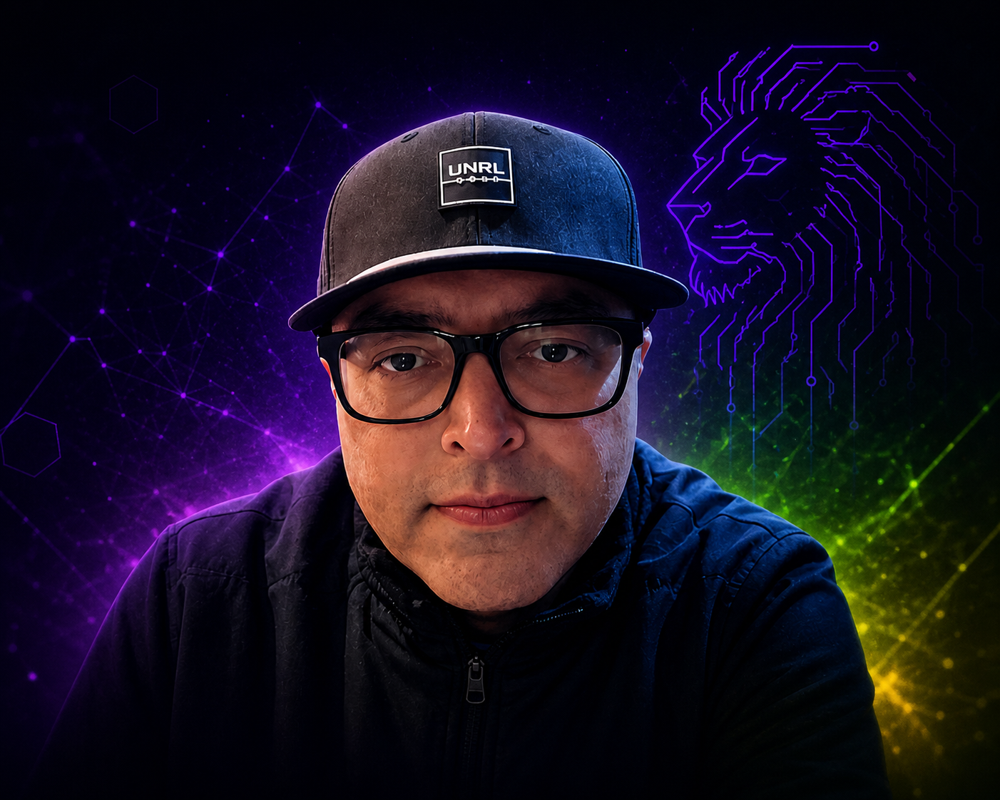

# 🦁 Navneet (Monk) Porwal — Portfolio & Beast AI Hero Academy

<div align="center">
  
  <br />
  <b>CIO | FOUNDER | LEAD MENTOR</b>
</div>

---

> **Governed by LeeWay Standards**  
> **Status:** PROD-READY | BRAND-ALIGNED  
> **Identity:** CIO | FOUNDER | LEAD MENTOR

---

## 🚀 The Mission: Beast AI Hero Academy
Beast AI Hero Academy isn't just a training center; it's a **global AI engine**. It is where high-potential individuals from the United States and India converge to transform from AI explorers into startup founders. 

In a world where AI is moving at terminal velocity, Monk leads the charge in building **Ethical AI Solutions Together (BEAST)**. We bridge the gap between enterprise legacy reality and the autonomous future.

### 🧠 The Academy Method
We don't just teach prompts; we build **architects**.
- **Explorer (Level 01):** Mastering foundational AI thinking.
- **Architect (Level 02):** Designing ethical, biased-free logic systems.
- **Leader (Level 03):** Orchestrating strategic AI governance.
- **Engineer (Level 04):** Scaling MLOps from prototype to global enterprise.

---

## 🔧 Technical Stack (LeeWay House Structure)
This portfolio is built following the strict **LeeWay Standards**, ensuring modularity, governance, and professional-grade architecture.

- **Framework:** React 19 + Vite
- **Styling:** Tailwind CSS (Modern Theme)
- **Animation:** Motion (framer-motion)
- **Governance:** LeeWay Standards Header Alignment
- **Identity:** Standardized 5WH Metadata Integration

---

## 🛠️ Run and Deploy

### 1. Initialize the Construct
Ensure you have Node.js installed.
```bash
npm install
```

### 2. Enter the Lab
Launch the development server to see the construct in action.
```bash
npm run dev
```

### 3. Build for the Fabric
Prepare the production bundle for deployment.
```bash
npm run build
```

---

## 🧠 Governance & Standards
This project adheres to the **LeeWay Standards**. Every file is integrated with an advisory header for traceability and alignment. 

**Watermark:** This project is officially protected and governed by **Leeway Innovations**.

---

## 🦁 Connect with Monk
- **Web:** [www.beastai.ai](https://www.beastai.ai) | [pivot2ai.org](https://pivot2ai.org)
- **Email:** contact@beastai.ai
- **Location:** Brookfield, Wisconsin, USA | Driving Global Transformation

---

*“Educate. Innovate. Transform. Empowering the next generation of AI leaders.”*  
**By Leeway Innovations**